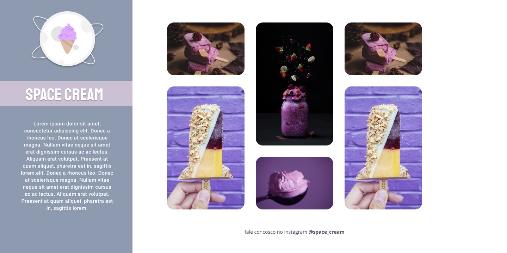
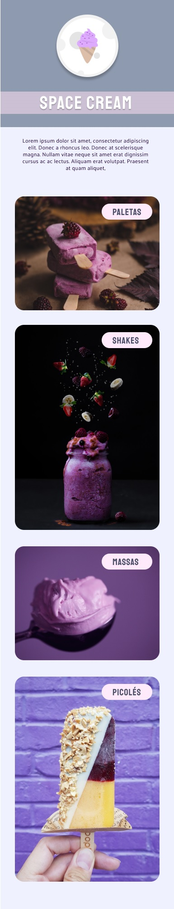

<h1> SpaceCream </h1>

 

<h2> O Projeto </h2>

O projeto foi desenvolvido como desafio do curso Explorer da Rocketseat. 

O desafio desse projeto consiste na criação de uma animação simples em uma landing page de sorvetes, trabalhando com animações em grid e mobile first. 

 

  
  

 

Quer conferir como ficou a landing page SpaceCream? 

[Visite o projeto online](https://eltonprado.github.io/Projeto10_SpaceCream/)

 

<h2> O intuito do projeto </h2>

O intuito do projeto foi colocar em prática os conhecimentos acerca de:

- HTML
- CSS
  - variáveis
  - Cores HSL
  - mobile first
  - @media / @keyframes
  - animations/ transitions/ transformations
  - grid-template-columns / grid-template-rows / grid-column / grid-auto-flow
  - place-content / align-items / justify-content / justify-content
  - centralizar div com position/grid/flex/margin
  - clamp

 

<h2> Tecnologias </h2>

Foi utilizado as seguintes tecnologias para desenvolver esse projeto:

- HTML
- CSS
- figma
- Git
- GitHub